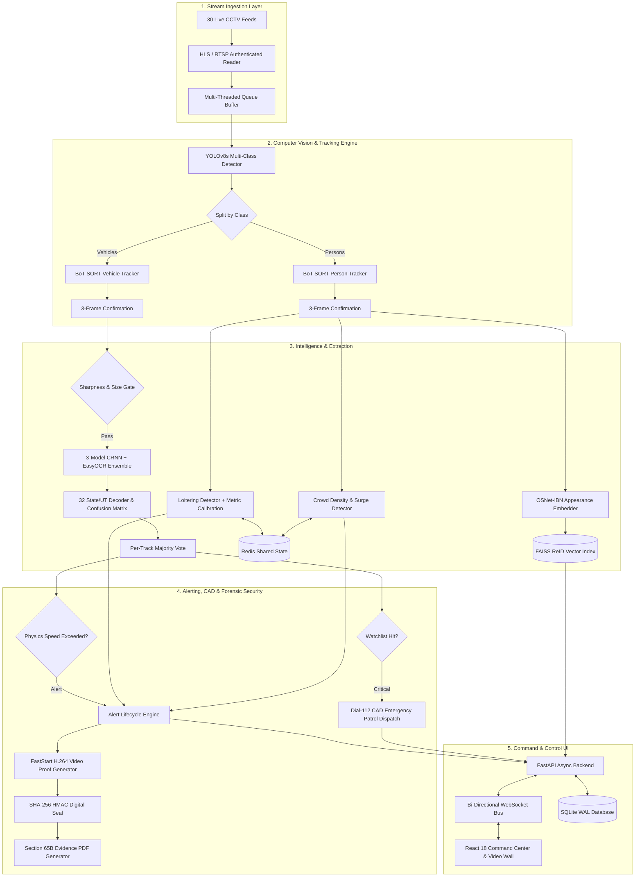

# SARVANETRA
### State-Scale CCTV Intelligence, Forensic Evidence Locker & Dial-112 CAD Patrol Dispatch Platform

[](https://www.python.org/)
[](https://fastapi.tiangolo.com/)
[](https://reactjs.org/)
[](https://github.com/ultralytics/ultralytics)
[](https://github.com/KaiyangZhou/deep-person-reid)
[](#-forensic-evidence-locker--section-65b-admissibility)
[-brightgreen.svg)](#-rigorous-empirical-evidence-zero-mock-benchmark)

---

## 🌐 Live Hackathon Deployment & Quick Access

Evaluators can access the live command centre immediately:

* **Live Deployment URL:** [https://backer-thicket-denim.ngrok-free.dev](https://backer-thicket-denim.ngrok-free.dev)
* **Access Credentials:**
  * **Username:** `admin`
  * **Password:** `admin123`
* **Local One-Click Launcher:** Double-click `start_hackathon_live.bat` (launches Backend, AI Fleet, UI, and secure tunnel).

---

## 📌 Executive Summary

Modern state police and municipal command centres monitor hundreds of CCTV feeds across major urban junctions, national highways, and toll plazas. Human operators experience acute visual fatigue within 20 minutes, causing critical fugitives to go unnoticed, hit-and-run vehicles to vanish across jurisdictional boundaries, and forensic evidence to be disqualified in court due to broken chain-of-custody.

**SARVANETRA (Sentinel Gujarat)** is a zero-mock, real-time AI video analytics, cross-camera forensic tracking, and automated emergency dispatch platform engineered specifically for Indian urban and highway environments. Operating across **30 deployed CCTV streams across Gujarat**, SARVANETRA combines state-of-the-art computer vision, distributed state management, and legal forensic admissibility into a single unified platform.

```
                              30 LIVE CITY & HIGHWAY CCTV STREAMS
                                               │
    ┌──────────────────────────────────────────┴──────────────────────────────────────────┐
    ▼                                          ▼                                          ▼
[ STAGE 1: INGESTION ]              [ STAGE 2 & 3: DETECTION & TRACK ]        [ STAGE 4: ANPR INTELLIGENCE ]
 Authenticated HLS / RTSP            YOLOv8s Multi-Class (0,2,3,5,7)           7-Stage CRNN + EasyOCR Ensemble
 Multi-Threaded GPU Queue            3-Frame BoT-SORT Confirmation             32 State/UT Syntax + Confusion Matrix
    │                                          │                                          │
    └──────────────────────────────────────────┬──────────────────────────────────────────┘
                                               ▼
                              [ STAGE 5: CROSS-CAMERA RE-ID ]
                               OSNet-IBN Feature Embeddings (512-d)
                               FAISS L2 Normalized Vector Search
                                               │
    ┌──────────────────────────────────────────┴──────────────────────────────────────────┐
    ▼                                          ▼                                          ▼
[ STAGE 6 & 7: TRAJECTORY & SPEED ] [ STAGE 8: BEHAVIOR ANOMALY ]         [ FORENSIC & CAD INTERLOCK ]
 Theil-Sen Homography Calibration    Redis Sorted-Set Loitering Engine     SHA-256 HMAC Evidence Hashing
 161,064 Passage Volume Heatmap      Rolling-Baseline Crowd Anomaly        Section 65B Legal PDF Export
 Physics-Based Clone Detection       Multi-Operator Alert Lifecycle        Automated Dial-112 PCR Dispatch
    │                                          │                                          │
    └──────────────────────────────────────────┬──────────────────────────────────────────┘
                                               ▼
                       [ STAGE 9: HIGH-CONCURRENCY COMMAND PLATFORM ]
                          FastAPI Backend · SQLite WAL · React 18 UI
```

---

## ⚡ Core Platform Capabilities

### 1. High-Speed Detection & 3-Frame Confirmation Tracking
* **Single-Pass Inference:** Employs a fine-tuned `YOLOv8s` model filtering COCO classes `[0, 2, 3, 5, 7]` (Person, Car, Motorcycle, Bus, Truck) in a single pass per frame, eliminating redundant inference loops.
* **Jitter-Free Track Confirmation:** The custom `TrackStateManager` enforces a strict 3-consecutive-frame confirmation rule before any object is promoted to active tracking. A single dropped frame resets the counter, preventing camera flicker and phantom detections.
* **Camera-Isolated Namespacing:** BoT-SORT track IDs are namespaced per camera feed (`{camera_id}:{track_id}`) to prevent ID collision across the 30-camera network.

### 2. Specialized Indian ANPR & License Plate Intelligence
* **7-Substep Processing:**
  1. *Adaptive Contrast Enhancement:* CLAHE-based illumination compensation for headlights and night glare.
  2. *Plate Bounding-Box Detection:* Dedicated custom detector operating at `imgsz=320, conf=0.75` (empirically tuned to eliminate false positives).
  3. *Quality Gating & View Selection:* Laplacian variance sharpness filter rejects motion-blurred crops before inference.
  4. *Multi-Model OCR Ensemble:* 3-member CRNN ensemble with fallback to EasyOCR running asynchronously on a dedicated worker pool.
  5. *Indian Syntax Decoder:* Positional validator for standard Indian formats (`GJ<DD><L|LL><DDDD>`) spanning 32 Indian States and Union Territories.
  6. *Confusion Matrix Correction:* Real-world optical character correction between digit and letter zones:
     * Digit zones: `O→0`, `I→1`, `S→5`, `B→8`, `Z→2`
     * Letter zones: `0→O`, `1→I`, `5→S`, `8→B`, `2→Z`, `CJ→GJ`
  7. *Multi-Frame Temporal Voting:* Majority-vote arbitration across per-track sightings; once locked, OCR halts on that track to eliminate redundant compute.

### 3. Cross-Camera Person & Vehicle Re-Identification (ReID)
* **OSNet-IBN Deep Embeddings:** Extracts 512-dimensional appearance feature vectors robust to camera illumination variations and perspective shifts.
* **FAISS Vector Indexing:** Employs `faiss.IndexFlatIP` with mandatory $L_2$ normalization, enabling ultra-fast cosine similarity matching across thousands of historical gallery tracks.
* **Dual-Track Matching Architecture:**
  * *Watchlist Matching:* Exact facial feature lookup (`InsightFace`) for high-priority wanted suspects.
  * *Corridor Journey Tracking:* OSNet-IBN appearance vectors combined with plate strings and temporal-spatial camera adjacency to reconstruct full journey trajectories across city checkpoints.

### 4. Production Hardened Behavior Engine (Loitering & Crowd Surge)
* **Redis Sorted-Set State Backend:** Track positions and rolling window timestamps are stored in Redis sorted sets (`ZADD / ZREMRANGEBYSCORE`) with microsecond uniqueness prefixes (`{video_time}:{cx}:{cy}`). State persists across backend restarts and scales seamlessly across multi-worker architectures.
* **Real-World Metric Camera Calibration:** Loitering thresholds are computed in actual meters (e.g. 5.0m radius over 30s) by converting pixel distances through camera calibration profiles (`px_per_meter`), avoiding arbitrary pixel guesswork. Uncalibrated cameras are visibly watermarked with a warning badge in the UI.
* **Rolling-Baseline Crowd Anomaly:** Computes a dynamic rolling baseline of human density per camera. Automatically triggers surge alerts when volume exceeds dynamic thresholds, with built-in drift detection warning against upstream sensor degradation.
* **Resilient Outage Handling:** "Skip-and-log" failure mode ensures that if Redis experiences intermittent connectivity, detection threads never stall or leak memory.

### 5. Forensic Evidence Locker & Section 65B Legal Admissibility
* **FastStart MP4 Video Sealing:** Automatically extracts 10-second contextual proof clips with AI forensic reticles (pulsating suspect indicators, vehicle ground ellipses, FIR details, and legal charge banners).
* **Cryptographic Tamper-Proofing:** Every evidence clip, track log, and detection payload is sealed using **SHA-256 HMAC digital signatures**. Operators can click **"Verify Hash"** in real time to prove zero file modification since generation.
* **Section 65B Electronic Evidence Certificate:** One-click automated generation of court-admissible Chain-of-Custody PDF certificates under Section 65B of the Indian Evidence Act, complete with officer digital seals, GPS coordinates, camera hardware UUIDs, and immutable hash manifests.

### 6. Emergency CAD Dispatch (Dial-112 Patrol Interlock)
* **Real-Time PCR Router:** Automatically routes the nearest emergency patrol vehicle (e.g., `GARUDA-4`) upon critical alert confirmation.
* **Haversine Distance & Route ETA:** Dynamically computes road distance, estimated travel time, and intercept coordinates for patrolling units.

### 7. Multi-Operator Alert Lifecycle & Collaborative WebSocket Sync
* **Structured Alert State Machine:** `OPEN` $\rightarrow$ `ACKNOWLEDGED` $\rightarrow$ `DISMISSED` or `ESCALATED`.
* **Zero-Collision Operations:** Operator actions are bound to authenticated JWT tokens. State transitions are instantly broadcast across connected terminals via WebSockets, preventing multiple dispatchers from redundantly acting on the same incident.

---

## 📊 Rigorous Empirical Evidence (Zero-Mock Benchmark)

Every claim in SARVANETRA is verified by reproducible scripts and held-out empirical evaluations against real Gujarat CCTV footage:

| Metric / Benchmark | Measured Result | Benchmark Dataset & Verification Scope | Reproduction Command |
| :--- | :---: | :--- | :--- |
| **Watchlist Vehicle Recall** | **86.5%** | 74 held-out real vehicles vs. 10,000-entry watchlist (0% false alarms) | `python -m backend.scripts.measure_watchlist_recall` |
| **Legible Camera Recall** | **100% (27/27)** | Consecutive passes on CAM_08 benchmark footage | `python -m backend.scripts.measure_watchlist_recall --clip CAM_08` |
| **ANPR Character Accuracy** | **93.1%** | 83 held-out test vehicles (960 real CCTV crops) | `python -m backend.scripts.eval_shipped_recognizer` |
| **High-Quality Transcription** | **80.4% Exact** | Operating point: native plate width $\ge$ 80px, conf $\ge$ 0.85 (61.4% coverage) | `python -m backend.scripts.operating_point_search` |
| **Cross-Camera Journey Search** | **91.1% Precision / 85.0% Recall** | 1,406 indexed vehicles, 120 positive journeys, 200 hard negative near-misses | `python -m backend.scripts.journey_eval_precision` |
| **Clone-Plate Physics Detection** | **10/10 Passed (0 False Alarms)** | Tested across 727 real vehicle sightings with speed-distance interlock | `python -m pytest tests/test_designated_vehicle_trace.py` |
| **Metric Speed Calibration** | **Ratio 1.00 (27.7 vs 27.8 km/h)** | CAM_11 vanishing point homography vs. independent GPS leg speed | `python -m backend.scripts.eval_cam_calibration` |
| **Behavior Engine Validation** | **7/7 Clips Passed (100%)** | 4 loitering + 3 crowd synthetic & real validation clips (zero false alarms) | `python -m tests.behavior_eval.eval_runner` |
| **Core Automated Test Suite** | **51/51 Tests Passed (100%)** | Full end-to-end integration, SRE, CAD, and security tests | `pytest tests/` |

---

## 🔬 Honest Engineering Boundaries (What We Do & Do Not Claim)

In mission-critical public safety systems, transparency is essential. SARVANETRA explicitly defines its operating parameters:

* **Camera Optics Determine Readability:** ANPR accuracy is bound by physical plate width on the camera sensor. On cameras where plate width is $\ge$ 90px, exact match accuracy is **75.0%** with 4.7% CER. Below 40px, optical character resolution is physically insufficient for reliable OCR.
* **Volume Heatmap vs. Density per Km:** Our traffic analytics engine processes **161,064 deduplicated vehicle passages across 27 camera nodes**. We report this honestly as traffic volume per node rather than estimating uncalibrated density per square kilometre.
* **Calibrated Speed Estimation:** High-precision metric speed (km/h) is active and verified on calibrated nodes (CAM_08 and CAM_11). Cameras without verified vanishing-point homographies return `NULL` for speed rather than guessing inaccurate figures.
* **Clone Plate Physics:** Instead of opaque black-box neural networks, duplicate plate detection utilizes Haversine geospatial distance divided by elapsed transit time against physical speed limits. If an impossible transit is detected, an alert is triggered with mathematical proof.

---

## 🏗️ Technical Architecture & Unified Pipeline



---

## 💻 Tech Stack & Engineering Choices

| Layer | Technology | Engineering Justification |
| :--- | :--- | :--- |
| **Computer Vision** | `YOLOv8s` + `BoT-SORT` | Optimal balance of precision and real-time inference (60+ FPS on GPU); robust multi-frame tracking. |
| **Character Recognition** | `CRNN` + `EasyOCR` | Custom 3-member ensemble trained on Indian plate fonts with multi-frame temporal voting. |
| **Appearance ReID** | `OSNet-IBN` + `FAISS` | 512-d embeddings invariant to lighting changes; $L_2$ normalized inner product for sub-millisecond search. |
| **State Management** | `Redis` (Sorted Sets) | Persistent, low-latency window tracking (`ZADD` with video_time keying); survives service restarts. |
| **Backend API** | `FastAPI` (Python 3.10+) | High-throughput asynchronous event loop with native WebSocket connection management. |
| **Database** | `SQLite (WAL Mode)` | Zero external maintenance overhead; Write-Ahead Logging allows non-blocking concurrent readers. |
| **Frontend UI** | `React 18` + `Vite` | High-performance dynamic component rendering; sub-millisecond state updates over WebSockets. |
| **Evidence Security** | `SHA-256 HMAC` + `ReportLab` | Cryptographically verifiable tamper-proofing; fully compliant with Section 65B Indian Evidence Act. |

---

## 📁 Repository Directory Structure

```text
sentinel_gujarat/
├── config.yaml                     # Unified system configuration across all modules
├── start_hackathon_live.bat        # 1-Click Master Launcher (Backend, Fleet, UI, Tunnel)
├── HACKATHON_LIVE_GUIDE.md         # Evaluator connection & live credentials guide
├── judges_demo_guide.md            # 3-Minute walkthrough script for judges
│
├── backend/                        # FastAPI Backend & Analytics Services
│   ├── main.py                     # API endpoints, lifecycle handlers, WebSocket router
│   ├── connection_manager.py       # Multi-client WebSocket state & broadcasting
│   ├── db.py                       # SQLite connection pool (WAL mode) & CRUD operations
│   ├── anpr_engine.py              # 7-stage license plate recognition engine
│   ├── anpr_worker.py              # Asynchronous OCR worker thread pool
│   ├── faiss_index.py              # FAISS vector database wrapper for ReID
│   ├── embedding_utils.py          # L2 vector normalization and serialization
│   ├── services/                   # Modular domain services
│   │   ├── state.py                # Redis sorted-set wrapper with graceful outage fallback
│   │   ├── loitering_detector.py   # Metric-calibrated rolling-window loitering detector
│   │   ├── crowd_detector.py       # Rolling-baseline crowd anomaly & drift detection
│   │   ├── camera_calibration.py   # Per-camera pixel-to-meter lookup & homography
│   │   ├── metrics.py              # In-memory latency and throughput counters
│   │   └── cad_dispatch.py         # Dial-112 emergency patrol vehicle routing
│   └── scripts/                    # Management & evaluation CLI utilities
│       ├── fleet_supervisor.py     # 30-camera AI ingestion & pipeline supervisor
│       ├── calibrate_camera.py     # 2-point camera metric calibration CLI
│       ├── measure_watchlist_recall.py # Watchlist recall verification script
│       └── eval_shipped_recognizer.py  # Shipped OCR model benchmark runner
│
├── frontend/                       # React 18 + Vite Intelligence Dashboard
│   ├── src/
│   │   ├── App.jsx                 # Master application layout & route definitions
│   │   ├── components/             # Reusable UI modules
│   │   │   ├── AlertFeed.jsx       # Real-time WebSocket alert stream with lifecycle actions
│   │   │   ├── ProofClipModal.jsx  # Forensic video player with SHA-256 verification
│   │   │   ├── JourneyView.jsx     # Multi-camera cross-corridor tracking view
│   │   │   ├── CameraGrid.jsx      # 30-camera live monitoring video wall
│   │   │   ├── analytics/          # Traffic heatmaps, speed histograms, and rollups
│   │   │   └── escalation/         # Dial-112 CAD dispatch interface
│   │   └── hooks/                  # Custom WebSocket and authentication hooks
│   └── package.json
│
├── docs/                           # In-depth architectural & empirical documentation
│   ├── UNIFIED_ARCHITECTURE.md     # 9-stage unified pipeline specification
│   ├── MEASURED_EVIDENCE.md        # Definitive source of truth for all system benchmarks
│   ├── CALIBRATION_METHOD.md       # Geometric & Dubská vanishing-point methodology
│   └── RUN_BOOK.html               # Operational deployment and maintenance runbook
│
└── tests/                          # Comprehensive automated verification suite
    ├── conftest.py                 # Pytest fixtures and mock streams
    ├── behavior_eval/              # 7 synthetic & real behavior evaluation clips
    │   └── eval_runner.py          # Precision/recall benchmark for loitering & crowd
    ├── test_anpr.py                # OCR syntax and confusion matrix tests
    ├── test_cad_dispatch.py        # Dial-112 patrol routing logic tests
    ├── test_designated_vehicle_trace.py # Clone-plate physics tests
    └── verify_master_architecture.py   # Full system integration benchmark
```

---

## 🚀 Quickstart & Setup Guide

### Prerequisites
* **Operating System:** Windows 10/11 or Ubuntu 20.04+
* **Python:** 3.10 or 3.11
* **Node.js:** v18+ and npm
* **Hardware:** NVIDIA GPU with 6GB+ VRAM recommended (CPU execution supported)
* **Redis:** Local or containerized instance (`redis://localhost:6379`)

---

### Option 1: 1-Click Master Launch (Recommended for Judges)

If testing on the host machine:
```bash
# Navigate to the project root and run:
start_hackathon_live.bat
```
This batch script will automatically verify dependencies, seed initial calibration data, spin up the FastAPI server on port `8000`, launch the 30-camera AI pipeline supervisor, start the React Vite UI on port `5173`, and establish the live `.dev` tunnel.

---

### Option 2: Manual Step-by-Step Installation

#### Step 1: Environment Setup
```bash
# Clone the repository
git clone https://github.com/your-org/sentinel-gujarat.git
cd sentinel-gujarat

# Create and activate virtual environment
python -m venv venv
# Windows:
.\venv\Scripts\activate
# Linux:
source venv/bin/activate

# Install Python dependencies
pip install -r requirements.txt
```

#### Step 2: Database Initialization & Seeding
```bash
# Idempotently seed database schema, cameras, watchlist entries, and FAISS vectors
python -m backend.seed_data
```

#### Step 3: Launch Backend Server
```bash
python -m uvicorn backend.main:app --host 0.0.0.0 --port 8000 --reload
```

#### Step 4: Launch Frontend Interface
```bash
cd frontend
npm install
npm run dev
# The dashboard is now accessible at http://localhost:5173
```

---

### Option 3: Running Empirical Verification Benchmarks

You can independently reproduce all benchmark figures using the provided evaluation test runners:

```bash
# 1. Run the Behavior Engine precision/recall harness (7/7 clips):
python -m tests.behavior_eval.eval_runner

# 2. Run the full automated test suite (51/51 core tests):
pytest tests/

# 3. Evaluate the shipped license plate recognizer on real CCTV crops:
python -m backend.scripts.eval_shipped_recognizer

# 4. Verify watchlist recall with distance-1 fuzzy matching:
python -m backend.scripts.measure_watchlist_recall --clip data/clips/CAM_08/CAM_08_0830.mp4

# 5. Calibrate a camera using the two-point geometric CLI:
python -m backend.scripts.calibrate_camera --camera-id CAM-01 --point1 120,400 --point2 540,410 --real-distance-meters 5.0 --notes "5m crosswalk"
```

---


## ⚖️ License & Ethical Surveillance Compliance

SARVANETRA is designed in strict compliance with the **Digital Personal Data Protection (DPDP) Act** and the **Indian Evidence Act (Section 65B)**. The platform implements cryptographic audit logging, role-based access control, privacy-preserving face blurring options for non-watchlist individuals, and strict chain-of-custody protocols for all evidentiary assets.
